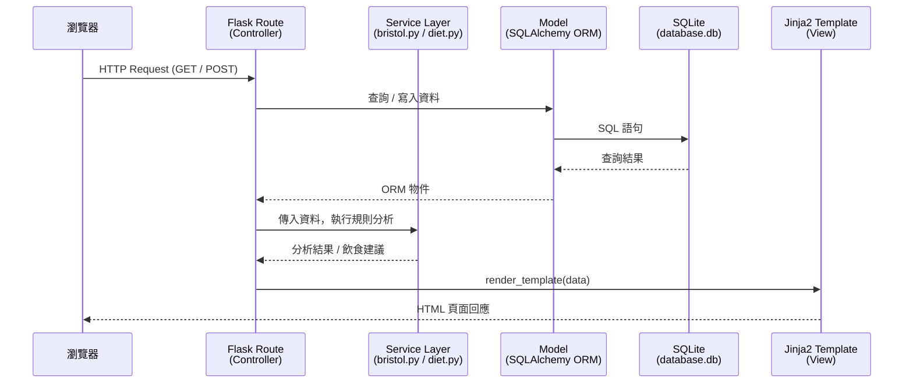

# 系統架構文件（ARCHITECTURE）

**專案名稱：** 糞便日誌（Poop Journal）
**版本：** v1.0
**建立日期：** 2026-05-19
**對應 PRD 版本：** v1.0

---

## 1. 技術架構說明

### 1.1 選用技術與原因

| 技術 | 版本建議 | 選用原因 |
|---|---|---|
| **Python** | 3.10+ | 語法簡潔，生態豐富，適合初學者快速上手 |
| **Flask** | 3.x | 輕量 Web 框架，路由清晰，彈性高，不強迫特定結構 |
| **Jinja2** | （Flask 內建）| 與 Flask 無縫整合，支援模板繼承，減少 HTML 重複 |
| **SQLite** | （Python 內建）| 零設定、單一檔案資料庫，適合 MVP 與個人專案 |
| **SQLAlchemy** | 2.x | ORM 自動防 SQL Injection，模型定義直觀 |
| **Vanilla JS / CSS** | — | 無需額外框架，降低學習成本，滿足 PRD 前端限制 |

### 1.2 Flask MVC 模式說明

本專案採用 **MVC（Model / View / Controller）** 架構模式，責任清楚分離：

| 角色 | 對應位置 | 負責什麼 |
|---|---|---|
| **Model** | `app/models/` | 定義資料表結構、資料存取邏輯（SQLAlchemy ORM） |
| **View** | `app/templates/` | Jinja2 HTML 模板，負責頁面呈現，不含業務邏輯 |
| **Controller** | `app/routes/` | Flask Blueprint 路由，接收 Request、呼叫 Model、回傳 View |

---

## 2. 專案資料夾結構

```
poop-journal/
│
├── app/                        ← 主應用程式套件
│   ├── __init__.py             ← 建立 Flask app、初始化 SQLAlchemy、註冊 Blueprint
│   │
│   ├── models/                 ← 資料庫模型（Model 層）
│   │   ├── __init__.py
│   │   ├── log.py              ← PoopLog 資料表（排便記錄）
│   │   └── suggestion.py       ← （選用）快取飲食建議邏輯
│   │
│   ├── routes/                 ← Flask 路由 / Controller 層
│   │   ├── __init__.py
│   │   ├── main.py             ← 首頁、Dashboard 路由
│   │   ├── logs.py             ← 新增、列表、詳細、編輯、刪除記錄
│   │   └── analysis.py         ← AI / 規則引擎分析、飲食建議
│   │
│   ├── templates/              ← Jinja2 HTML 模板（View 層）
│   │   ├── base.html           ← 共用 Layout（導覽列、頁尾）
│   │   ├── index.html          ← 首頁 / Dashboard
│   │   ├── logs/
│   │   │   ├── new.html        ← 新增排便記錄表單
│   │   │   ├── list.html       ← 歷史記錄列表
│   │   │   ├── detail.html     ← 單筆記錄詳細頁
│   │   │   └── edit.html       ← 編輯記錄表單
│   │   └── analysis/
│   │       ├── result.html     ← AI 分析結果卡片
│   │       └── suggestion.html ← 飲食建議頁面
│   │
│   ├── static/                 ← 靜態資源（前端）
│   │   ├── css/
│   │   │   └── style.css       ← 全站樣式（RWD、字體 ≥16px）
│   │   ├── js/
│   │   │   └── main.js         ← 互動邏輯（表單驗證、圖表初始化）
│   │   └── img/
│   │       └── bristol/        ← 布里斯托類型示意圖（Type 1–7）
│   │
│   └── services/               ← 業務邏輯層（獨立於路由）
│       ├── __init__.py
│       ├── bristol.py          ← 布里斯托規則引擎（Type → 健康說明）
│       └── diet.py             ← 飲食建議規則引擎（趨勢 → 建議內容）
│
├── instance/
│   └── database.db             ← SQLite 資料庫檔案（由 SQLAlchemy 自動建立）
│
├── tests/                      ← 單元測試
│   ├── test_models.py
│   ├── test_routes.py
│   └── test_services.py
│
├── docs/                       ← 專案文件
│   ├── PRD.md
│   ├── ARCHITECTURE.md         ← 本文件
│   └── ...（後續 DB_DESIGN、FLOWCHART 等）
│
├── app.py                      ← 應用程式入口（create_app、run）
├── config.py                   ← 環境設定（開發 / 正式環境）
├── requirements.txt            ← Python 相依套件
└── .env                        ← 環境變數（SECRET_KEY、OPENAI_API_KEY 等）
```

---

## 3. 元件關係圖

### 3.1 請求 / 回應流程（Request / Response Flow）



### 3.2 元件依賴圖（ASCII 版）

```
┌─────────────────────────────────────────────────────────┐
│                         瀏覽器                           │
│            （HTML 表單 / JavaScript / CSS）              │
└──────────────────────┬──────────────────────────────────┘
                       │ HTTP Request / Response
┌──────────────────────▼──────────────────────────────────┐
│               Flask Routes（Controller）                 │
│   main.py / logs.py / analysis.py                       │
└────────┬──────────────────────┬───────────────────────┘
         │                      │
┌────────▼──────┐     ┌─────────▼──────────┐
│    Services   │     │    Models (ORM)     │
│  bristol.py   │     │  log.py             │
│  diet.py      │     │  suggestion.py      │
└───────────────┘     └─────────┬───────────┘
                                │ SQLAlchemy
                       ┌────────▼───────────┐
                       │  SQLite Database   │
                       │  instance/database.db│
                       └────────────────────┘
         │
┌────────▼──────────────────────────────────────────────┐
│               Jinja2 Templates（View）                  │
│   base.html / logs/*.html / analysis/*.html            │
└───────────────────────────────────────────────────────┘
```

---

## 4. 關鍵設計決策

### 決策 1：使用 Flask Blueprint 拆分路由

**問題：** 所有路由放在單一 `app.py` 會造成程式碼難以維護。

**決策：** 將路由依功能拆分為三個 Blueprint：
- `main`（首頁 / Dashboard）
- `logs`（記錄 CRUD）
- `analysis`（分析與建議）

**好處：** 各功能模組獨立，方便多人分工開發，未來新增功能（如帳號系統）只需新增 Blueprint，不影響現有程式碼。

---

### 決策 2：新增獨立的 `services/` 層處理業務邏輯

**問題：** 若把布里斯托規則引擎、飲食建議邏輯直接寫在路由裡，路由會過於肥大，也難以單獨測試。

**決策：** 建立 `app/services/` 資料夾，將純邏輯函式（無 HTTP 概念）獨立管理。

**好處：**
- 路由保持簡潔，只做「接收 Request → 呼叫服務 → 回傳 Response」
- 服務層可獨立撰寫單元測試，不需啟動 Flask
- 未來替換規則引擎為 OpenAI API，只需修改 `services/bristol.py`，路由零變動

---

### 決策 3：使用 SQLAlchemy ORM，而非直接使用 sqlite3

**問題：** 直接使用 `sqlite3` 套件需手動撰寫 SQL，容易產生 SQL Injection 漏洞，且難以維護。

**決策：** 使用 SQLAlchemy ORM 定義模型，透過 ORM 進行所有資料庫操作。

**好處：**
- 自動參數化查詢，防止 SQL Injection（符合 PRD 安全需求）
- 模型定義即文件，欄位清晰易讀
- 未來若需要換成 PostgreSQL，只需修改 `config.py` 中的 `SQLALCHEMY_DATABASE_URI`

---

### 決策 4：採用 `base.html` 模板繼承減少重複

**問題：** 多個頁面共用導覽列、頁尾、CSS/JS 引入，若每頁獨立撰寫會產生大量重複。

**決策：** 建立 `base.html` 作為所有頁面的父模板，子模板只覆寫 `` 區塊。

**好處：**
- 全站 UI 修改只需改 `base.html`（導覽列、主題色）
- 子模板聚焦在業務內容，程式碼精簡

---

### 決策 5：MVP 階段使用規則引擎，保留 AI API 擴充空間

**問題：** OpenAI API 有費用與網路延遲，MVP 階段不適合強依賴外部 API。

**決策：** `services/bristol.py` 與 `services/diet.py` 以 Python 字典 / 規則表實作分析邏輯；函式介面設計為 `analyze(log) → result`，與外部 API 無關。

**好處：**
- MVP 可離線運作，零額外費用
- 未來整合 OpenAI API 只需修改 `services/bristol.py` 內部實作，呼叫端（路由、模板）完全不需改動

---

## 5. 環境設定說明

```python
# config.py 範例

class DevelopmentConfig:
    DEBUG = True
    SECRET_KEY = "dev-secret-key"  # 正式環境請從 .env 讀取
    SQLALCHEMY_DATABASE_URI = "sqlite:///database.db"
    SQLALCHEMY_TRACK_MODIFICATIONS = False

class ProductionConfig:
    DEBUG = False
    SECRET_KEY = os.environ.get("SECRET_KEY")
    SQLALCHEMY_DATABASE_URI = os.environ.get("DATABASE_URL", "sqlite:///database.db")
    SQLALCHEMY_TRACK_MODIFICATIONS = False
```

---

## 6. 下一步

完成本文件後，建議依序進行：

1. **`docs/FLOWCHART.md`** — 使用 `/flowchart` skill 產出使用者操作流程圖
2. **`docs/DB_DESIGN.md`** — 使用 `/db-design` skill 設計資料表 Schema
3. **`docs/API_DESIGN.md`** — 使用 `/api-design` skill 規劃所有 Flask 路由
4. **實作** — 使用 `/implementation` skill 逐一實作路由與模板

---

*本文件由 Antigravity AI 輔助生成，請團隊確認後進行修改與補充。*
