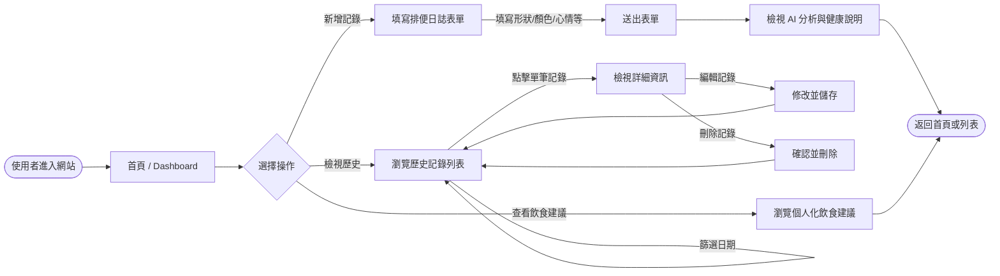
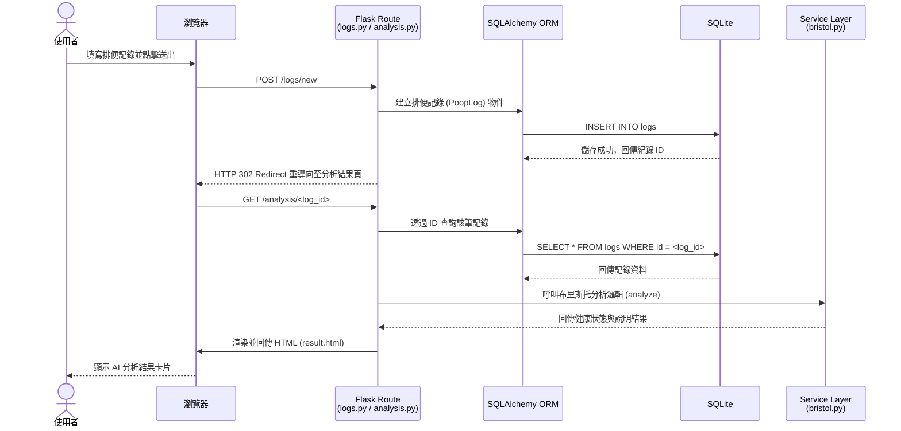

# 流程圖設計 (FLOWCHART)

**專案名稱：** 糞便日誌 (Poop Journal)
**建立日期：** 2026-05-19

---

## 1. 使用者流程圖 (User Flow)

這張圖描述了使用者從進入網站開始，在系統中可能進行的各種操作路徑，包含新增紀錄、查看歷史以及獲取飲食建議。

## 2. 系統序列圖 (Sequence Diagram)

這張圖詳細描述了「使用者填寫新增表單並送出」到「資料存入資料庫並顯示分析結果」的完整系統互動過程。

## 3. 功能清單對照表

根據 PRD 與系統架構，規劃出對應的 URL 路徑與 HTTP 方法，為後續的 API 設計與實作打下基礎。

| 功能 | 說明 | URL 路徑 | HTTP 方法 | 對應 Blueprint |
|---|---|---|---|---|
| **首頁 / Dashboard** | 進入系統的第一頁，顯示簡單摘要與操作入口 | `/` | GET | `main` |
| **填寫記錄表單** | 顯示新增排便記錄的表單頁面 | `/logs/new` | GET | `logs` |
| **新增記錄** | 接收表單提交的資料並存入資料庫 | `/logs/new` | POST | `logs` |
| **歷史記錄列表** | 列出所有的排便記錄，支援日期篩選功能 | `/logs` | GET | `logs` |
| **記錄詳細頁** | 查看單筆排便記錄的詳細資料與心情 | `/logs/<id>` | GET | `logs` |
| **編輯記錄表單** | 顯示編輯特定記錄的頁面 | `/logs/<id>/edit` | GET | `logs` |
| **更新記錄** | 接收編輯後的資料並更新資料庫 | `/logs/<id>/edit` | POST | `logs` |
| **刪除記錄** | 刪除特定的排便記錄 | `/logs/<id>/delete` | POST | `logs` |
| **AI 分析結果** | 根據記錄 ID 顯示當次糞便的健康分析與說明 | `/analysis/<id>` | GET | `analysis` |
| **飲食建議** | 根據近期歷史紀錄提供綜合的飲食調整建議 | `/analysis/suggestion` | GET | `analysis` |

---
*本文件由 Antigravity AI 根據 PRD 與 ARCHITECTURE 產生，供團隊確認整體流程與頁面規劃。*
