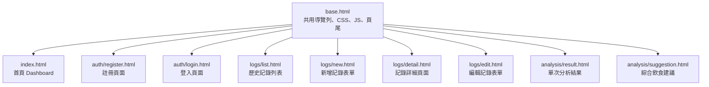

# 路由設計文件 (ROUTES)

**專案名稱：** 糞便日誌 (Poop Journal)  
**版本：** v1.0  
**建立日期：** 2026-05-26  
**對應架構版本：** v1.0

---

## 1. 路由總覽表格

以下為系統所有路由的總覽，包含 HTTP 方法、URL 路徑、對應的 Jinja2 模板與簡要說明。根據 HTML 表單（Form）的限制，更新與刪除操作一律採用 `POST` 方法。

| 功能模組 | 功能名稱 | HTTP 方法 | URL 路徑 | 對應模板 | 說明 |
| :--- | :--- | :--- | :--- | :--- | :--- |
| **首頁** | Dashboard 首頁 | GET | `/` | `index.html` | 顯示健康看板、最近記錄摘要與操作入口 |
| **認證 (Auth)** | 註冊頁面 | GET | `/register` | `auth/register.html` | 顯示註冊表單 |
| | 註冊動作 | POST | `/register` | — | 接收並驗證註冊資料，寫入 DB 後登入 |
| | 登入頁面 | GET | `/login` | `auth/login.html` | 顯示登入表單 |
| | 登入動作 | POST | `/login` | — | 驗證使用者憑證，寫入 Session 後重導向 |
| | 登出動作 | POST (或 GET) | `/logout` | — | 清除 Session 登出，並導向登入頁面 |
| **排便記錄 (Logs)** | 歷史記錄列表 | GET | `/logs` | `logs/list.html` | 顯示歷史排便日誌，支援日期範圍篩選 |
| | 新增記錄頁面 | GET | `/logs/new` | `logs/new.html` | 顯示布里斯托與心情記錄表單 |
| | 建立新記錄 | POST | `/logs/new` | — | 儲存新排便記錄，並重導向至分析結果 |
| | 記錄詳細頁面 | GET | `/logs/<int:id>` | `logs/detail.html` | 顯示單筆記錄詳細欄位與分析說明 |
| | 編輯記錄頁面 | GET | `/logs/<int:id>/edit` | `logs/edit.html` | 顯示編輯特定記錄的預填表單 |
| | 更新記錄動作 | POST | `/logs/<int:id>/edit` | — | 接收編輯資料並更新 DB，隨後重導向 |
| | 刪除記錄動作 | POST | `/logs/<int:id>/delete`| — | 從 DB 刪除特定記錄，隨後重導向至列表 |
| **分析建議 (Analysis)**| 單次分析結果 | GET | `/analysis/<int:id>`| `analysis/result.html`| 顯示單次排便布里斯托等級之健康分析卡片 |
| | 綜合飲食建議 | GET | `/analysis/suggestion`| `analysis/suggestion.html`| 根據近期排便趨勢提供個人化飲食與生活建議 |

---

## 2. 每個路由的詳細說明

### 2.1 首頁 / Dashboard
*   **路由**：`GET /` (Blueprint: `main`)
*   **輸入**：無（從 `session` 中取得當前登入的 `user_id`）
*   **處理邏輯**：
    1.  檢查使用者是否已登入：
        *   若**已登入**：查詢當前使用者（`User.get_by_id(user_id)`），並取得最近的排便記錄（如最近 5 筆）及統計數據（本週排便次數、最常出現的布里斯托類型、健康比例）。
        *   若**未登入**（訪客）：提供基本的系統介紹與登入/註冊入口，或可供訪客在 Session 中儲存臨時記錄（若有此需求）。本階段優先顯示系統首頁與引導登入。
    2.  準備 Chart.js 所需之數據結構（排便次數統計、類型分布）。
*   **輸出**：渲染 `index.html`。
*   **錯誤處理**：若資料庫查詢失敗，回傳 500 錯誤頁面。

---

### 2.2 認證模組 (Auth)

#### 2.2.1 註冊
*   **路由**：`GET /register` (Blueprint: `auth`)
    *   **輸入**：無
    *   **處理邏輯**：若使用者已登入，直接重導向至首頁 `/`；否則顯示註冊頁面。
    *   **輸出**：渲染 `auth/register.html`。
*   **路由**：`POST /register` (Blueprint: `auth`)
    *   **輸入**：表單欄位 `username`, `password`, `confirm_password`。
    *   **處理邏輯**：
        1.  驗證欄位是否填寫。
        2.  檢查 `password` 與 `confirm_password` 是否一致。
        3.  檢查密碼長度（例如需大於 6 位元）。
        4.  檢查 `username` 是否已被註冊（`User.get_by_username(username)`）。
        5.  若驗證皆通過，呼叫 `User.create(username, password)` 寫入資料庫。
        6.  將新註冊的 `user_id` 寫入 `session['user_id']`（自動登入），重導向至首頁 `/`。
    *   **輸出**：重導向至 `/`，或在驗證失敗時渲染 `auth/register.html`。
    *   **錯誤處理**：驗證失敗時，使用 Flask `flash()` 傳遞錯誤訊息，回傳 HTTP 400（或以 200 帶錯誤提示渲染）。

#### 2.2.2 登入
*   **路由**：`GET /login` (Blueprint: `auth`)
    *   **輸入**：無
    *   **處理邏輯**：若已登入則重導向至 `/`；否則顯示登入表單。
    *   **輸出**：渲染 `auth/login.html`。
*   **路由**：`POST /login` (Blueprint: `auth`)
    *   **輸入**：表單欄位 `username`, `password`。
    *   **處理邏輯**：
        1.  驗證欄位是否填寫。
        2.  查詢使用者 `user = User.get_by_username(username)`。
        3.  檢查 `user` 是否存在，且密碼雜湊是否吻合（`user.check_password(password)`）。
        4.  驗證通過後，將 `user.id` 寫入 `session['user_id']`，重導向至 `/`。
    *   **輸出**：重導向至 `/`，驗證失敗時重新渲染 `auth/login.html`。
    *   **錯誤處理**：憑證錯誤時，使用 `flash()` 提示「帳號或密碼錯誤」，回傳 HTTP 401。

#### 2.2.3 登出
*   **路由**：`POST /logout` 或 `GET /logout` (Blueprint: `auth`)
    *   **輸入**：無
    *   **處理邏輯**：清除 `session` 中的 `user_id` 與其他登入憑證，並重導向至登入頁 `/login`。
    *   **輸出**：重導向至 `/login`。

---

### 2.3 排便記錄模組 (Logs)

#### 2.3.1 歷史記錄列表
*   **路由**：`GET /logs` (Blueprint: `logs`)
    *   **輸入**：可選 URL 參數 `start_date` (格式: `YYYY-MM-DD`), `end_date` (格式: `YYYY-MM-DD`)。
    *   **處理邏輯**：
        1.  確認登入狀態（若未登入，導向登入頁或允許存取訪客的 Null `user_id` 紀錄，此處預設要求登入）。
        2.  解析日期篩選條件。
        3.  呼叫 `PoopLog.get_all(user_id=current_user_id, start_date=start_date, end_date=end_date)` 查詢記錄。
    *   **輸出**：渲染 `logs/list.html`，傳入記錄列表與當前的篩選日期。
    *   **錯誤處理**：日期格式解析錯誤時，忽略該篩選，並提示警告。

#### 2.3.2 新增記錄
*   **路由**：`GET /logs/new` (Blueprint: `logs`)
    *   **輸入**：無
    *   **處理邏輯**：顯示新增表單，預設排便時間為當前時間。
    *   **輸出**：渲染 `logs/new.html`。
*   **路由**：`POST /logs/new` (Blueprint: `logs`)
    *   **輸入**：表單欄位 `bristol_type` (int, 1-7), `color` (str), `odor` (str, 可為空), `mood` (str), `note` (str, 可為空), `date_time` (str, 轉換為 datetime)。
    *   **處理邏輯**：
        1.  驗證 `bristol_type` 必須在 1-7 之間。
        2.  驗證 `color` 與 `mood` 欄位為系統支援的選項。
        3.  解析 `date_time`，若未填或格式不正確，則使用目前系統時間。
        4.  呼叫 `PoopLog.create(...)` 寫入資料庫，並獲取新增之紀錄 `id`。
        5.  重導向至單次分析結果頁面 `/analysis/<new_log_id>`。
    *   **輸出**：重導向至 `/analysis/<id>`，驗證失敗時重新渲染 `logs/new.html` 並帶回原填寫內容。
    *   **錯誤處理**：欄位驗證失敗時回傳 HTTP 400，於頁面提示錯誤欄位。

#### 2.3.3 記錄詳細頁
*   **路由**：`GET /logs/<int:id>` (Blueprint: `logs`)
    *   **輸入**：URL 參數 `id`（記錄 ID）。
    *   **處理邏輯**：
        1.  呼叫 `PoopLog.get_by_id(id)`。
        2.  若記錄不存在，回傳 HTTP 404。
        3.  檢查權限：若該記錄之 `user_id` 不等於當前登入者 ID，回傳 HTTP 403 拒絕存取。
        4.  渲染詳細資料。
    *   **輸出**：渲染 `logs/detail.html`。
    *   **錯誤處理**：404 Not Found 或 403 Forbidden。

#### 2.3.4 編輯與更新記錄
*   **路由**：`GET /logs/<int:id>/edit` (Blueprint: `logs`)
    *   **輸入**：URL 參數 `id`。
    *   **處理邏輯**：查詢該筆記錄，進行權限驗證，若成功則將現有資料帶入編輯表單中。
    *   **輸出**：渲染 `logs/edit.html`。
*   **路由**：`POST /logs/<int:id>/edit` (Blueprint: `logs`)
    *   **輸入**：URL 參數 `id`，表單欄位 `bristol_type`, `color`, `odor`, `mood`, `note`, `date_time`。
    *   **處理邏輯**：
        1.  查詢紀錄並驗證權限。
        2.  驗證輸入欄位之合法性。
        3.  呼叫 `log.update(...)` 更新資料庫。
        4.  重導向至詳細頁面 `/logs/<id>`。
    *   **輸出**：重導向至 `/logs/<id>`，驗證失敗重新渲染編輯頁。
    *   **錯誤處理**：欄位不合法回傳 400；記錄不存在回傳 404；權限不足回傳 403。

#### 2.3.5 刪除記錄
*   **路由**：`POST /logs/<int:id>/delete` (Blueprint: `logs`)
    *   **輸入**：URL 參數 `id`。
    *   **處理邏輯**：
        1.  查詢紀錄並驗證權限。
        2.  呼叫 `log.delete()` 移除記錄。
        3.  重導向至歷史列表 `/logs`。
    *   **輸出**：重導向至 `/logs`。
    *   **錯誤處理**：記錄不存在回傳 404；權限不足回傳 403。

---

### 2.4 分析建議模組 (Analysis)

#### 2.4.1 單次分析結果
*   **路由**：`GET /analysis/<int:id>` (Blueprint: `analysis`)
    *   **輸入**：URL 參數 `id` (即該次排便記錄的 ID)。
    *   **處理邏輯**：
        1.  查詢該筆排便紀錄，並確認權限。
        2.  呼叫 `app/services/bristol.py` 中的 `analyze(log)` 規則引擎，傳入排便記錄。
        3.  取得布里斯托外觀說明、健康狀態（例如：正常、輕微便秘等）與基礎衛教建議。
    *   **輸出**：渲染 `analysis/result.html`，展示分析卡片。
    *   **錯誤處理**：記錄不存在回傳 404；權限不足回傳 403。

#### 2.4.2 綜合飲食建議
*   **路由**：`GET /analysis/suggestion` (Blueprint: `analysis`)
    *   **輸入**：無
    *   **處理邏輯**：
        1.  確認登入狀態（必須登入）。
        2.  查詢該使用者近 14 天內所有的排便記錄。
        3.  若記錄筆數少於 3 筆，則提示記錄不足，無法提供準確趨勢建議。
        4.  將記錄清單傳入 `app/services/diet.py` 中的 `generate_suggestion(logs)` 規則引擎。
        5.  分析出使用者近期偏向「便秘型」、「腹瀉型」或「正常」，並計算平均排便次數。
        6.  生成對應的飲食方針（例如：補水計畫、高膳食纖維食物清單、應避免之辛辣刺激性食物等）。
        7.  （選用）將此建議快取至 `DietSuggestion` 資料表。
    *   **輸出**：渲染 `analysis/suggestion.html`。
    *   **錯誤處理**：記錄不足時，頁面顯示友善的提示與返回按鈕。

---

## 3. Jinja2 模板清單與繼承關係

全站頁面均繼承自共用 Layout，藉此維持統一的主題風格與 UI 配置。

### 模板詳細說明
1.  `base.html` (根模板)：定義全站 `<head>` 資訊、網頁標題、引入 CSS（`style.css`）、互動 JS（`main.js`），以及全站導覽列（Navbar）與頁腳（Footer）。提供 `` 區塊供子頁面覆寫。
2.  `index.html` (繼承 `base.html`)：顯示近期健康看板。包含 Chart.js 排便趨勢圖、常用功能捷徑與最近排便紀錄摘要。
3.  `auth/register.html` (繼承 `base.html`)：提供使用者帳號註冊表單，包含表單前端密碼長度與一致性初步驗證。
4.  `auth/login.html` (繼承 `base.html`)：提供使用者登入表單。
5.  `logs/list.html` (繼承 `base.html`)：以卡片或表格形式條列顯示歷史記錄。包含日期區間篩選表單，可快速篩選「近一週」、「近一月」或自訂區間。
6.  `logs/new.html` (繼承 `base.html`)：新增記錄頁面。以布里斯托 1-7 型的圖片卡片輔助使用者點擊選擇，並以表情符號（emoji）選擇心情。
7.  `logs/detail.html` (繼承 `base.html`)：詳細紀錄頁面。除了顯示當次記錄的完整數值外，也包含返回列表、編輯此筆、刪除此筆等操作按鈕。
8.  `logs/edit.html` (繼承 `base.html`)：編輯頁面。與新增表單結構相似，但欄位預填原先儲存的舊數值。
9.  `analysis/result.html` (繼承 `base.html`)：呈現單次排便的布里斯托大便等級解析，以彩色卡片與圖文顯示是否健康及卫教小貼士。
10. `analysis/suggestion.html` (繼承 `base.html`)：呈現根據近期趨勢分析產生的飲食生活改善建議，以清晰的標題與列表（如：建議攝取、應避免、補水提示）呈現。

---
*本文件為糞便日誌系統的路由設計，並作為路由骨架及後續實作的依據。*
